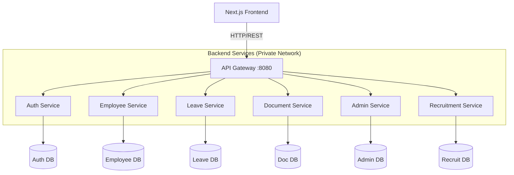

# 🚀 Enterprise HR Platform (Microservices & Next.js)

**HR Platform**, modern kurumsal ihtiyaçlar için tasarlanmış, ölçeklenebilir **Mikroservis Mimarisi** üzerine kurulu, uçtan uca bir İnsan Kaynakları ve İşe Alım Yönetim Sistemidir.


---

## 📖 Proje Hakkında

Bu proje, geleneksel monolitik İK yazılımlarının aksine, **bağımsız, dağıtık ve ölçeklenebilir** servisler bütünü olarak tasarlanmıştır. Ön yüzde **Next.js (App Router)** ile yüksek performanslı ve SEO dostu bir deneyim sunarken, arka planda **Spring Boot** ekosistemi ve **Docker** konteynerizasyonu ile kurumsal standartları karşılar.

---

### 🏗️ Mimari Tasarım

Sistem, **API Gateway** arkasında çalışan ve birbirleriyle **OpenFeign** üzerinden haberleşen izole servislerden oluşur.

---



---

✨ Temel Özellikler
1. 🔐 Güvenlik ve Kimlik Yönetimi
JWT (JSON Web Token): Stateless oturum yönetimi.

RBAC (Role-Based Access Control): Admin, Manager ve User rolleriyle sayfa ve veri bazlı yetkilendirme.

Auto-Provisioning: Yeni personel kartı oluşturulduğunda, otomatik olarak kullanıcı hesabı (Login) açılması.

2. 👥 Personel ve Organizasyon
Hiyerarşik Yönetim: Sınırsız derinlikte ast-üst ilişkisi kurabilme.

İnteraktif Org. Şeması: Şirket yapısını ağaç (Tree View) şeklinde görselleştirme.

Akıllı Atama: Sürükle-bırak veya seçim ile yönetici atamaları ve pozisyon zorunluluğu kontrolleri.

Master Data Yönetimi: Departman, Unvan ve Pozisyonların merkezi yönetimi.

3. ⚙️ Dinamik Yönetim Paneli (CMS)
Veritabanı Güdümlü Menü: Kod değişikliği yapmadan, veritabanından yönetilen Sidebar yapısı.

Sürükle & Bırak (Drag & Drop): Menü sıralamasını ve alt-üst ilişkilerini görsel olarak düzenleme.

Yetki Bazlı Görünüm: Hangi menünün hangi roller tarafından görülebileceğinin seçilmesi.

4. 🎯 İşe Alım (ATS - Recruitment Modülü)
Aday Havuzu: Adayların yetenek, tecrübe ve iletişim bilgilerinin takibi.

Gelişmiş Filtreleme: Teknoloji, tecrübe yılı, okul gibi kriterlere göre dinamik sorgulama (JPA Specifications).

Süreç Yönetimi: Adayın durumunun (Telefon, Teknik Mülakat, Teklif vb.) yönetilmesi.

5. 🧩 İş Akışları (Workflows)
İzin Yönetimi: Personel talep oluşturur -> Yönetici onayına düşer -> Onay/Red süreci.

Belge Operasyonları: Personel belge talep eder -> İK havuzuna düşer -> İK uzmanı işi üzerine alır -> Tamamlar.

6. 🌍 Globalizasyon
Çoklu Dil (i18n): next-intl altyapısı ile tam Türkçe/İngilizce desteği.

---

## 🛠️ Teknoloji Yığını

| Alan | Teknolojiler |
| :--- | :--- |
| **Frontend** |     |
| **Backend** |     |
| **Veritabanı** |  |
| **DevOps & Araçlar** |    |
| **Mimari** |    |

---

🚀 Kurulum ve Çalıştırma
Projenin tamamını (Frontend + 6 Backend Servisi + Veritabanları) ayağa kaldırmak için bilgisayarınızda sadece Docker yüklü olması yeterlidir.

1. Projeyi Klonlayın
```bash
git clone [https://github.com/efecantekin/hr-platform.git](https://github.com/efecantekin/hr-platform.git)
cd hr-platform
```

2. Sistemi Başlatın
Aşağıdaki komut, tüm servisleri derler, Docker imajlarını oluşturur ve konteynerleri başlatır.

```bash
docker-compose up --build -d
```

3. Erişim Bilgileri
* **Sistem açıldığında aşağıdaki adreslerden erişebilirsiniz:
   * Web Arayüzü: http://localhost:3000
   * API Gateway: http://localhost:8080

* **Varsayılan Yönetici Girişi:
   * Kullanıcı: admin (Veritabanı boşsa API üzerinden oluşturulmalıdır)
   * Şifre: 123

---

### 📱 Arayüzden Görüntüler


---

### 🔮 Gelecek Planları (Roadmap)
* [ ] Bildirim Sistemi: RabbitMQ entegrasyonu ile asenkron e-posta bildirimleri.
* [ ] Raporlama: PDF ve Excel formatında personel/izin raporları.
* [ ] Swagger/OpenAPI: Tüm mikroservisler için merkezi API dokümantasyonu.
* [ ] CI/CD: GitHub Actions ile otomatik deploy süreçleri.
